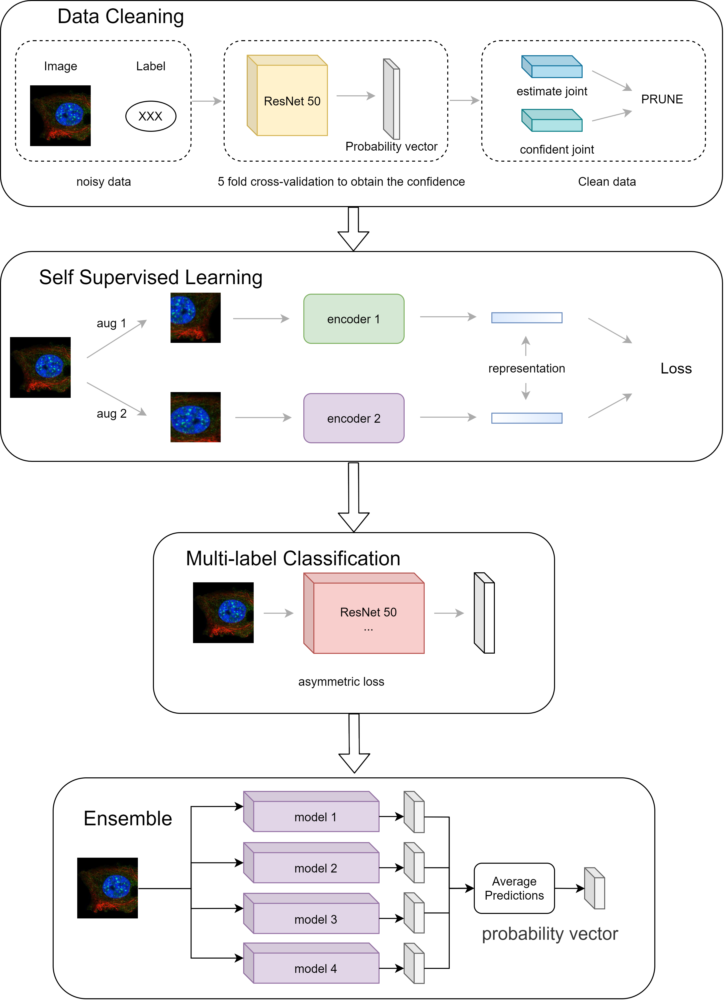

# Team basic information
Ming Feng,  Ph.D. candidate in Histopathological Image Analysis, Tongji University, Shanghai, China

Kele Xu, Assistant Professor, Focus on Medical Image Analysis, National Key Laboratory of Parallel and Distributed Processing (PDL), Changsha, China

# Framework of our solution
</img>

# Pipeline to run this code

### Some writes-up can be found in (https://www.dropbox.com/s/vuug46cdqk6noop/final%20-%20V2.pdf?dl=0)

### Step 1: Data preparation

Download HPA data and put it under /input/hpa-single-cell-image-classification.

Download the training set Cell Mask (https://www.kaggle.com/its7171/hpa-mask) and put it under /input/hpa-mask/train.

* For public data sets, you need to run /code/HPA-Cell-Segmentation/cell_mask.ipynb to generate cell segmentation maps.

### Step 2: Install dependencies

Install Cell Segmentation. (https://github.com/CellProfiling/HPA-Cell-Segmentation)

The repo has been cloned to /code/.

### Step 3: Get the test set Mask

Run /code/HPA-Cell-Segmentation/cell_mask.ipynb to get the Cell Mask of the test set.

### Step 4: Training data generation

Run /code/cell_extract.ipynb to extract single-cell images from the training set and test set.

* For the entire image, only RGB channels are used and scaled to 1024*1024 size (this part of the code is not included in the Repo).
* Cells can be re-assigned to category 18 tag according to the max value of the green channel (this part of the code is not included in this Repo).

### Step 5: Multi-label classification training

Run /code/classification-fastai.ipynb multi-label classification training and generate single-cell prediction results.

* For different cells model and whole image model, some code needs to be modified: model architecture, mean and std, and training image size.

### Step 6: Results generation

Run /code/generate_submission.ipynb to get the submission result in the required format.

### Step 7: Results submission

The results are submitted.

## Tools

* /code/kaggle_submission.py

  Used to generate results locally and submit them.

* /code/download_hpapublic.py

  Download the public dataset, but the data provided by the competition is messy. In order to save time, this file is downloaded in jpg format instead of the original resolution file.

  You can refer to:

  https://www.kaggle.com/lnhtrang/hpa-public-data-download-and-hpacellseg

  https://www.kaggle.com/c/hpa-single-cell-image-classification/discussion/217021#1219554

  https://www.kaggle.com/philculliton/hpa-challenge-2021-extra-train-images

  Simply put, the official offer includes three parts:

  * tif.gz original resolution image (the official demo is downloaded as a 16-bit image and saved as an 8-bit image)
  * jpg image
  * Not a complete png image dataset

  In addition, the HPAv18 public data set provided by the first competition is about 78,000. The current HPAPublic data set is about 80,000, and the intersection is 70,000. The first training set can also be used.

  To summarize, the currently available data sets include:

  * HPA2's official training set
  * HPA2's official public data set
  * HPA1's training set (have intersection with the current training data set)
  * HPA1's public data set (have intersection with the current public data set)

  

## Requirement

fastai: 2.2.5
